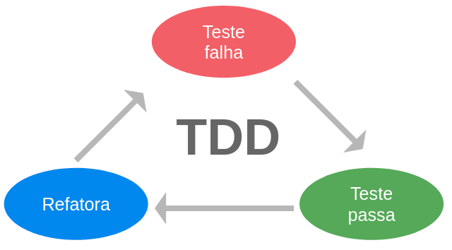

# Artigo científico - TCC - Engenharia de Computação - 2021
Artigo científico do Trabalho de Conclusão de Curso (TCC) do curso de 
Engenharia de Computação - UNISAL São José - 2021

## Título
Desenvolvimento de firmware robusto e multiplataforma

## Prosposta

Demonstrar a necessidade de se estimular as boas práticas de 
desenvolvimento de firmware, a utilização de testes automatizados 
e independentes do hardware, e o estudo de conceitos de 
engenharia de software que auxiliem na redução de bugs e consequentemente, 
redução de custos do projeto e aumento da qualidade do código gerado.

### TDD - Test-driven development
`Test-driven development` (ou `Desenvolvimento orientado a testes`) é 
uma técnica incremental de construção de software. 
Nessa técnica, nenhum código de produção é escrito sem que primeiro seja escrito um 
teste unitário que falhe na primeira execução. 

Ao contrário da prática comum de desenvolvimento de software, onde primeiro 
é desenvolvido o código de produção e só depois os testes, no TDD
o desenvolvedor expressa o comportamento desejado do código em um teste. 
O teste é executado e falha. Só então ele escreve o código de produção, fazendo o 
teste passar.
A automação de testes é a chave para o `TDD`. Os testes são pequenos e 
automatizados.
A cada nova funcionalidade implementada, novos testes unitários são escritos, 
seguidos imediatamente por um código de produção que satisfaça aqueles testes. 

Conforme o código de produção cresce, também crescem em conjunto os testes unitários, 
que são ativos tão valiosos quanto o próprio código de produção. 
A cada mudança de código, o conjunto de testes é executado, verificando a 
funcionalidade da nova implementação, mas também a compatibilidade com o código já 
existente.




## Metodologia
A metodologia utilizada para o desenvolvimento do projeto segue a técnica de 
`TDD` (`Test-driven development`).

### Ferramentas utilizadas

- FreeRTOS - sistema operacional de tempo real
- GNU make - Build system para compilação do código de produção
- GCC(x86) e GCC(arm)- compiladores para ambas arquiteturas
- VS Code - editor de textos
- Ceedling - Build system para compilação e execução dos testes
- Unity - framework de testes
- Cmock - ferramenta de dublê de testes

### Desenvolvimento

O processo de desenvolvimento do projeto seguiu o padrão especificado anteriormente,
juntamente com algumas regras e boas práticas:

- Clean Code (Código limpo) - o código precisa ser de fácil entendimento
- KISS (Keep it simple stupid) - as soluções implementadas precisam ser simples
- SOLID principles - seguir os padrões do SOLID
- Boy Scout Principle (Regra do escoteiro) - 
"Deixe o campo mais limpo do que quando o encontrou" - Sempre deixe 
código melhor do antes de você trabalhar nele
- Refactoring (Refatoração) - o código precisa ser refatorado e aprimorado constatemente

...
#### Implementando testes unitários
A implementação de testes unitários exige a utilização de um framework
de testes. Foi utilizado o Unity, ferramenta já contida no Ceedling. 
Usando os comandos do próprio build system para a criação
do projeto, temos a seguinte linha de comando:

```
$ ceedling new projeto-exemplo
```
....
#### Utilizando dublês de teste
Dublês de teste são utilizados nos casos em que há dependência de algum componente 
externo e o módulo precisa ser testado. O driver de GPIO é um 
exemplo de dependência de hardware, nesse caso, é interessante o uso 
de dublês de teste. A ferramenta responsável pela geração desses dublês é o 
Cmock.
...

#### Dual-targeting 
O processo de `Dual-targeting` só é possível quando se consegue independência
entre os módulos de software.

## Conclusão
WIP
